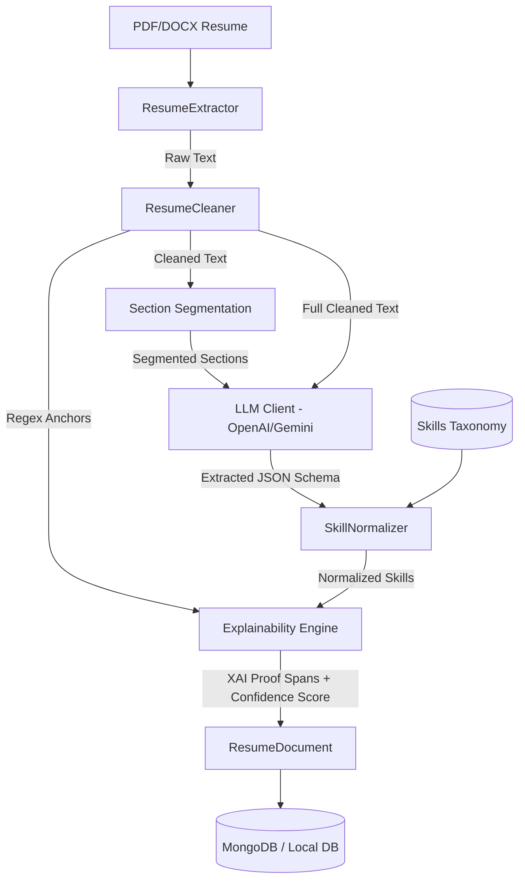

# Research-Grade AI Resume Parsing & Entity Extraction Pipeline

This repository contains a modular, production-ready, and research-grade **Resume Parsing & Entity Extraction Pipeline**. It is designed as the core ingestion framework for an **AI-Powered IT Recruitment & Fraud Detection System**. 

The system goes beyond naive regex parsers and basic LLM API calls, introducing hybrid NLP verification, semantic skill normalisation, and Explainable AI (XAI) traceability.

---

## 🛠️ Technology Stack & Selection Rationale

- **Backend Framework**: `FastAPI` (High performance, async event loop, automatic OpenAPI/Swagger generation).
- **Text Extraction**: `pypdf` (layout-preserving PDF extractor) & `python-docx` (with structural table recovery).
- **LLM Engine**: `OpenAI GPT-4o-mini` (primary structured outputs) + `Google Gemini 1.5 Flash` (automated secondary failover) utilizing strict JSON Schema bindings.
- **Natural Language Processing**: `spaCy` (rule-based pattern matching, sentence boundaries, and base Named Entity Recognition (NER) anchors).
- **Semantic Mapping**: `sentence-transformers` (`all-MiniLM-L6-v2`) for dense vector representations of skills and taxonomy alignment.
- **Database**: `MongoDB` (schema-free nested document store) with `motor` (async driver) and a zero-config `Local File Database` mode for direct local execution.

---

## 🏗️ System Architecture



### Advanced Pipeline Flow:
1. **Extraction**: Accepts PDF/DOCX files. Detects tables, columns, and preserves page boundaries.
2. **Text Cleaning**: Normalises white spaces, strip-out garbage characters, and extracts **Contact Anchors** (emails, phones, profile links) via deterministic regex.
3. **Section Segmentation**: Segments the text into functional blocks (e.g., `Education`, `Work Experience`, `Skills`) using keyword-based boundaries to contextualise extractions.
4. **LLM Entity Extraction**: Invokes the LLM using **Strict JSON schemas**. If OpenAI encounters an error or rate limit, the pipeline automatically fails over to Gemini.
5. **Skill Normalisation**: Resolves raw skills (e.g. `ReactJS`, `react.js`) into their canonical taxonomy representations (e.g. `React`) using embedding-based cosine similarity.
6. **Explainable AI (XAI) & Audit Tracing**: Map every single extracted entity back to the original text. Find the exact substring index and sentence snippet to prove the extraction came from the resume (thwarts LLM hallucinations).
7. **Confidence Scoring**: Combines LLM confidence, regex-anchor matches, and date anomaly flags to generate a unified confidence index (0.0 to 1.0) and validation report.

---

## 🧬 Research Novelty & Paper Contribution Ideas

This implementation provides three core contributions that can be highlighted in a final year academic paper:

### 1. Explainable AI (XAI) Traceability in Recruitment Ingestion
Traditional LLM parsers act as black boxes, exposing recruitment pipelines to hallucinations (e.g., generating fake qualifications). By computing character-span traces (`TraceSpan`) linking every extracted attribute back to its exact text snippet in the resume, this system provides **explainability and audit trails** for HR audits.

### 2. Hybrid Heuristic-LLM Verification & Confidence Calibration
The pipeline introduces a **Dual-Engine Confidence Scorer** combining:
- **Heuristic verification** (confirming extracted emails/GitHub links against pre-LLM regex-extracted anchors).
- **Temporal coherence check** (flagging date anomalies, e.g., overlapping employments or start years occurring after end years).
The resulting score represents a calibrated confidence metric that mitigates LLM overconfidence.

### 3. Dense Vector-Space Taxonomy Grounding
Instead of relying on rigid keyword lists, the pipeline embeds extracted skills and maps them semantically onto a standard IT skill taxonomy using cosine similarity. This resolves synonyms and detects advanced competencies without manual rule building.

---

## 📂 Project Structure

```
├── app/
│   ├── __init__.py
│   ├── main.py              # FastAPI Application Entry & Lifespans
│   ├── api/
│   │   ├── __init__.py
│   │   └── endpoints/
│   │       ├── health.py    # System & ML Service Health Checks
│   │       └── parser.py    # Sync & Async Upload & Polling Routes
│   ├── core/
│   │   ├── config.py        # Environmental Configurations
│   │   └── exceptions.py    # Standardized Domain Exceptions
│   ├── db/
│   │   ├── __init__.py      # Dynamic DB Connection Factory
│   │   ├── base.py          # Abstract Database Adapter
│   │   ├── local_db.py      # JSON File Storage Adapter
│   │   └── mongodb.py       # Async Motor MongoDB Adapter
│   ├── models/
│   │   ├── resume.py        # Resume Models (Entity & Normalized Schema)
│   │   └── status.py        # Async Tasks Status Schema
│   ├── services/
│   │   ├── cleaner.py       # Cleaning & Section Segmentation
│   │   ├── explainability.py# XAI Span Locator & Confidence Evaluator
│   │   ├── extractor.py     # PDF & DOCX Extraction Services
│   │   ├── llm_client.py    # OpenAI & Gemini Structured API Client
│   │   ├── normalizer.py    # Semantic Skill Normalizer (SentenceTransformers)
│   │   └── pipeline.py      # Orchestrating Parser Pipeline
│   └── tests/
│       └── test_parser.py   # Complete Unit & Integration Test Suite
├── data/
│   └── taxonomy.json        # Skills Taxonomy & Aliases database
├── app_data/                # Local database storage directory (Auto-generated)
├── requirements.txt         # Package Dependencies
├── .env                     # Local settings (Auto-generated)
└── README.md                # System Documentation
```

---

## ⚡ Setup & Installation

### 1. Clone & Set Up Environment
Ensure Python 3.10+ is installed on your system.

```bash
# Verify Python version
python --version

# Install dependencies
pip install -r requirements.txt
```

### 2. Configure Environment Variables
Open the `.env` file generated in the root directory:

```env
OPENAI_API_KEY=your-openai-api-key
GEMINI_API_KEY=your-gemini-api-key
DB_TYPE=local  # Swap to 'mongodb' once a live Mongo DB instance is connected
MONGODB_URL=mongodb://localhost:27017
DB_NAME=recruitment_fraud_db
SKILL_SIMILARITY_THRESHOLD=0.75
```

---

## 🧪 Running the Test Suite

Run the unit and integration tests to verify the pipeline's functions (e.g., text cleaning, section separation, skill normalization, confidence reporting):

```bash
python -m app.tests.test_parser
```

---

## 🚀 Running the FastAPI Server

Start the development server with hot-reloading enabled:

```bash
python -m app.main
```
The API documentation will be available at: **[http://127.0.0.1:8000/docs](http://127.0.0.1:8000/docs)**.

---

## 📡 API Reference

### 1. Upload Resume (Synchronous)
- **Endpoint**: `POST /api/v1/parser/upload`
- **Payload**: Multipart Form-data (`file`: PDF or DOCX)
- **Response**: The complete `ResumeDocument` JSON object.

### 2. Upload Resume (Asynchronous / Queue-Based)
- **Endpoint**: `POST /api/v1/parser/upload-async`
- **Payload**: Multipart Form-data (`file`: PDF or DOCX)
- **Response**:
```json
{
  "task_id": "426be237-7756-42d4-bbdb-7c2763f915f0",
  "status": "PENDING",
  "message": "Resume parsing queued in the background.",
  "poll_url": "http://127.0.0.1:8000/api/v1/parser/tasks/426be237-7756-42d4-bbdb-7c2763f915f0"
}
```

### 3. Poll Task Status
- **Endpoint**: `GET /api/v1/parser/tasks/{task_id}`
- **Response** (When complete):
```json
{
  "task_id": "426be237-7756-42d4-bbdb-7c2763f915f0",
  "status": "COMPLETED",
  "created_at": "2026-05-26T07:35:15Z",
  "updated_at": "2026-05-26T07:35:20Z",
  "filename": "john_doe_cv.pdf",
  "resume_id": "9a2f3f1e-f3b1-419b-ab09-7a54fce00bfd",
  "error": null
}
```

### 4. Retrieve Parsed Resume
- **Endpoint**: `GET /api/v1/parser/resumes/{resume_id}`

---

## 🔮 Integration with Fraud Detection (Next Steps)

This parser is structurally prepared to directly plug into external fraud validation modules:
1. **GitHub Consistency**: The extracted `github` profile URL can be queried via the GitHub API. The languages parsed from repositories can be compared to the `normalized_skills` list using embedding distance to check for skill mismatches.
2. **Experience Inflation**: Extracted project descriptions and employment roles can be compared against commit history metadata to assess technical depth and flag fake experience.
3. **Anomalies**: The `validation_report` contains validation flags that show chronological mismatches or profile naming variances.
